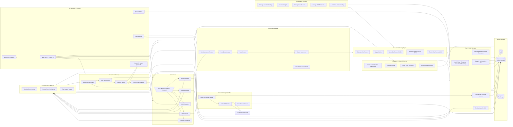

# test-mermaid

```mermaid
flowchart LR
    %% ============ GUI / CLIENT ============
    subgraph GUI["GUI / Client"]
        User[\"User (Ministry / Holding / Company)"/]
        RunAssessment["Run Assessment"]
        ViewDashboards["View Dashboards"]
        AskAI["Ask AI Question"]
        ViewForecast["View Forecast"]
        CompareCompanies["Compare Companies"]
    end

    %% ============ ACCESS & TENANT ============
    subgraph AccessMgr["Access & Tenant Manager"]
        ResolveTenant["Resolve Tenant Context"]
        EnforceRBAC["Enforce Role Permissions"]
        FilterData["Filter Data by Tenant"]
    end

    %% ============ ASSESSMENT & EVALUATION ============
    subgraph AssessmentMgr["Assessment Manager"]
        StartAssessment["Start Assessment Session"]
        LoadQuestionnaire["Load Questionnaire"]
        SaveAnswer["Save Answer"]
        FinalizeAssessment["Finalize Assessment"]
        ListAssessments["List Company Assessments"]
    end

    subgraph EvalEngine["Evaluation & Scoring Engine"]
        CalcRaw["Calculate Raw Scores"]
        ApplyWeights["Apply Weights"]
        Normalize["Normalize Scores (0..100)"]
        CalcMaturity["Compute Maturity Levels (1..5)"]
        PersistScores["Persist Final Scores & KPIs"]
    end

    %% ============ AI ASSISTANT & FORECAST ============
    subgraph AIAssistant["AI Assistant Manager"]
        DetectIntent["Detect Question Intent"]
        BuildContext["Build RAG Context"]
        CallLLM["Call LLM Server"]
        PostProcess["Post-process AI Answer"]
    end

    subgraph ForecastMgr["Forecast Manager (LSTM)"]
        BuildFeatures["Build Time-Series Features"]
        CallLSTM["Call LSTM Service"]
        SaveForecast["Save Forecast Results"]
    end

    %% ============ CONFIGURATION ============
    subgraph ConfigMgr["Configuration Manager"]
        ManageQuestions["Manage Question Catalog"]
        ManageWeights["Manage Weights"]
        MaturityRules["Manage Maturity Rules"]
        RiskThresholds["Manage Risk Thresholds"]
        VersionConfig["Serialize / Version Config"]
    end

    %% ============ DATA & STORAGE ============
    subgraph DataMgr["Data & Model Manager"]
        LoadEntities["Load Entities (Company, Assessment, Answers)"]
        SaveAggregates["Save Aggregated Scores & Summaries"]
        QueryDash["Query for Dashboards & KPIs"]
        ProvideRAGViews["Provide Views for RAG"]
        ProvideLSTMData["Provide Data for LSTM Features"]
    end

    subgraph Storage["Storage Manager"]
        DB[(MySQL / MariaDB)]
        Cache[(Redis)]
        Files[(File Storage)]
    end

    %% ============ INTEGRATION & INFRA ============
    subgraph Integration["Integration & External Systems"]
        ImportMarket["Import Capital Market / External Data"]
        ExportBI["Export to BI / DW"]
        SSO["SSO / LDAP Integration"]
        SchedImports["Scheduled Imports (Jobs)"]
    end

    subgraph Infra["Infrastructure & Runtime"]
        WebServer["Web Server + PHP-FPM"]
        QueueWorkers["Queue Workers"]
        Scheduler["Job Scheduler"]
        LLMServer["Local LLM Server (Qwen2.5)"]
        Monitor["Monitoring & Logging"]
    end

    %% ============ FLOWS ============

    %% GUI to Access
    User --> RunAssessment
    User --> ViewDashboards
    User --> AskAI
    User --> ViewForecast
    User --> CompareCompanies

    RunAssessment --> AccessMgr
    ViewDashboards --> AccessMgr
    AskAI --> AccessMgr
    ViewForecast --> AccessMgr
    CompareCompanies --> AccessMgr

    AccessMgr --> AssessmentMgr
    AccessMgr --> AIAssistant
    AccessMgr --> ForecastMgr
    AccessMgr --> DataMgr

    %% Assessment Flow
    RunAssessment --> StartAssessment
    StartAssessment --> LoadQuestionnaire
    LoadQuestionnaire --> SaveAnswer
    SaveAnswer --> FinalizeAssessment
    FinalizeAssessment --> EvalEngine

    EvalEngine --> DataMgr
    DataMgr --> DB

    %% Dashboards
    ViewDashboards --> DataMgr
    DataMgr --> QueryDash
    QueryDash --> DB
    QueryDash --> Cache

    %% AI Assistant Flow
    AskAI --> DetectIntent
    DetectIntent --> BuildContext
    BuildContext --> ProvideRAGViews
    ProvideRAGViews --> DB
    BuildContext --> CallLLM
    CallLLM --> LLMServer
    LLMServer --> CallLLM
    CallLLM --> PostProcess
    PostProcess --> GUI

    %% Forecast Flow
    ViewForecast --> ForecastMgr
    ForecastMgr --> BuildFeatures
    BuildFeatures --> ProvideLSTMData
    ProvideLSTMData --> DB
    BuildFeatures --> CallLSTM
    CallLSTM --> LSTMServer["LSTM Service (Python)"]
    LSTMServer --> CallLSTM
    CallLSTM --> SaveForecast
    SaveForecast --> DB

    %% Config
    ConfigMgr --> DataMgr
    ConfigMgr --> EvalEngine

    %% Storage relations
    DataMgr --> DB
    DataMgr --> Cache
    DataMgr --> Files

    %% Integration
    Integration --> DataMgr
    Integration --> Storage

    %% Infra
    WebServer --> GUI
    WebServer --> AssessmentMgr
    WebServer --> AIAssistant
    WebServer --> ForecastMgr
    QueueWorkers --> DataMgr
    Scheduler --> ForecastMgr
    Scheduler --> Integration
    Monitor --> Infra
```
